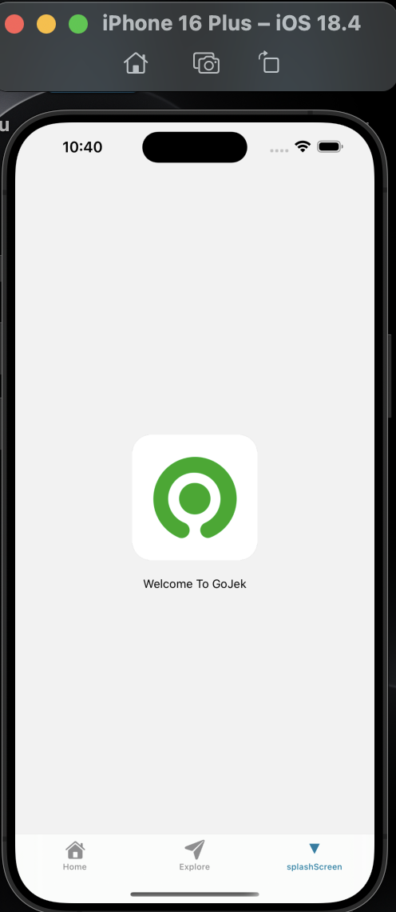
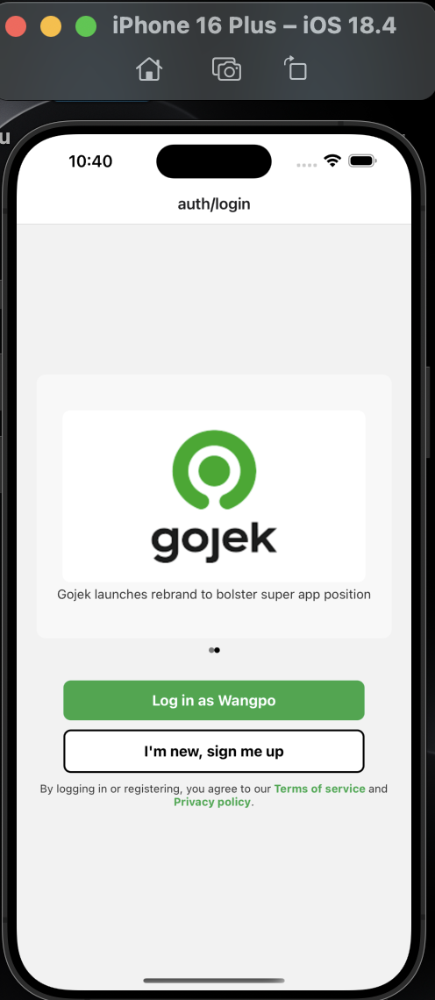
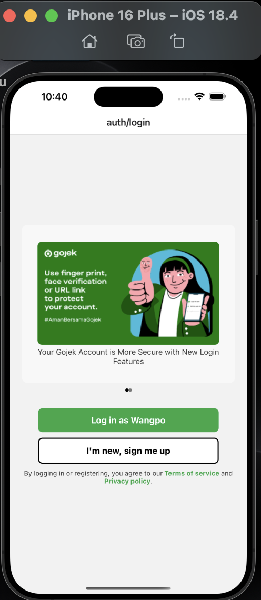
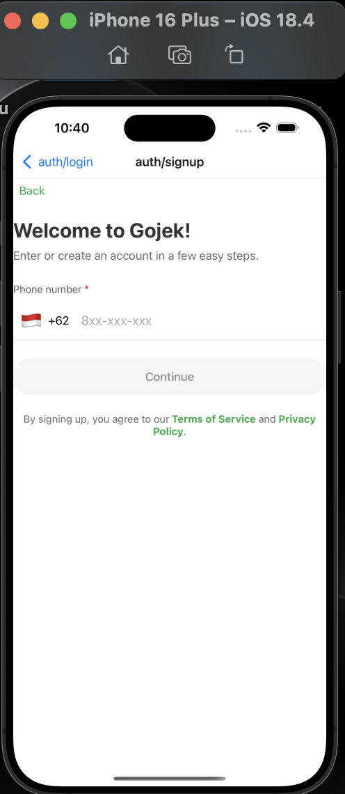
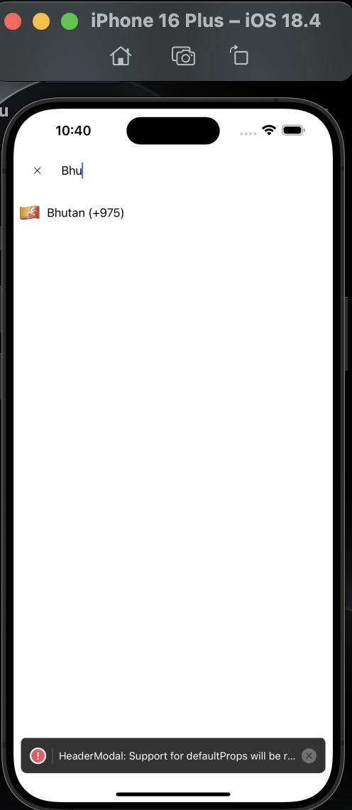
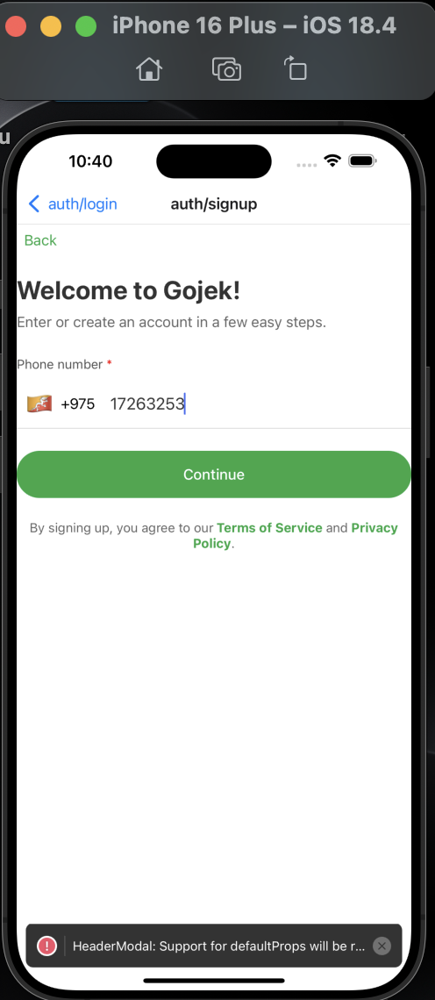
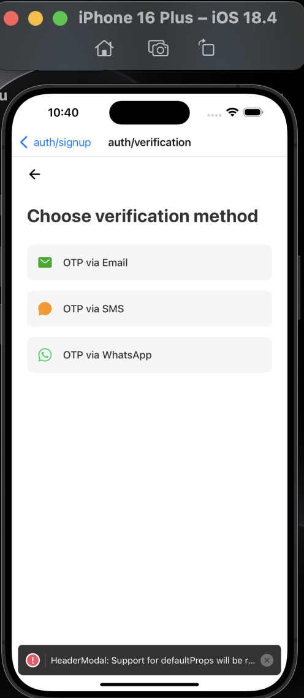
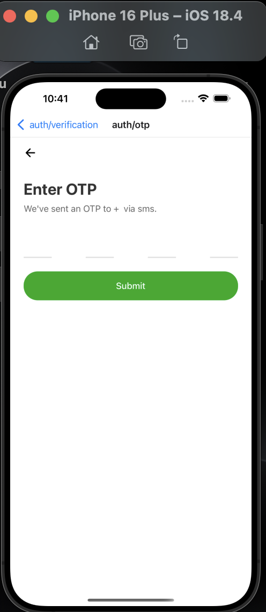

# Welcome 👋 to practical 1 of SWE201

This is an [Expo](https://expo.dev) project created with [`create-expo-app`](https://www.npmjs.com/package/create-expo-app).

## Get started

1. Install dependencies

   ```bash
   npm install
   ```

2. Start the app

   ```bash
    npx expo start
   ```

In the output, you'll find options to open the app in a

- [development build](https://docs.expo.dev/develop/development-builds/introduction/)
- [Android emulator](https://docs.expo.dev/workflow/android-studio-emulator/)
- [iOS simulator](https://docs.expo.dev/workflow/ios-simulator/)
- [Expo Go](https://expo.dev/go), a limited sandbox for trying out app development with Expo

You can start developing by editing the files inside the **app** directory. This project uses [file-based routing](https://docs.expo.dev/router/introduction).

## Get a fresh project

When you're ready, run:

```bash
npm run reset-project
```

This command will move the starter code to the **app-example** directory and create a blank **app** directory where you can start developing.

## Learn more for the course first time and the Documentation about Expo

To learn more about developing your project with Expo, look at the following resources:

- [Expo documentation](https://docs.expo.dev/): Learn fundamentals, or go into advanced topics with our [guides](https://docs.expo.dev/guides).
- [Learn Expo tutorial](https://docs.expo.dev/tutorial/introduction/): Follow a step-by-step tutorial where you'll create a project that runs on Android, iOS, and the web.

# Practical 1 
## **Goals**: 
For this practical is to develop a multipage application using the Expo Router.

### 1. Lets create a splash screen the application. 

This implements in the root layout for an Expo Router-based React Native application. Its execution is as follows:

**Splash Screen Management**

   
   Used the ;
   
   ```code
   SplashScreen.preventAutoHideAsync();
   ```

* To prevent the splash screen from automatically hiding until the app's assets are loaded. 

* This ensures a smooth transition from the splash screen to the main content of the app and then loaded the fonts and theme.



### 2. Implementation of login Screen

In login screen, it has the following features:

* **Carousel for Displaying Information**:  
  - Displayes a carousel of images and its descriptions and the array contains the images and descriptions. 
   - The components allows uers to navigate between carousel items by scrolling horizontally.




### Creating a signup screen

This implements the Signup screen for a React native application using Expo Router. The screen allows user to enter their phone number and select their country, and navigate to the verification page.



Features
1. Country Picker:

   Allows users to select their country.
   Displays the country code (e.g., +62 for Indonesia).

   

   

2. Phone Number Input:
   Users can input their phone number.
   Validates the phone number to ensure it has at least 8 digits.

3. Dynamic Button State:

   The "Continue" button is disabled until the phone number is valid.
   The button changes color to indicate when it is clickable.

   
4. Navigation:

   Navigates to the `/auth/verification` page with the phone number and country code as parameters as shown below:

   

### 3. OTP screen

The user after entering their phone number and country code is navigated to the methoud of verification (OTP, Email, etc). In this case, the user is navigated to the OTP screen. The OTP screen allows the user to enter a 4-digit verification UI as shown below:




## Conclusion
By this practical, it was a great experience to learn about the Expo Router and how to implement a multipage application using Expo Router. The practical also helped me to understand how to use the Expo Router for navigation and how to implement a splash screen, login screen, signup screen, and OTP screen in a React Native application.