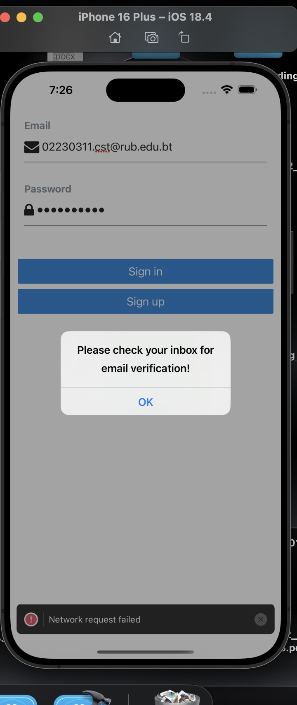

# Email and Password Authentication with Supabase

This project demonstrates how to implement email and password authentication in a React Native application using Supabase. It includes features like secure credential handling, email verification, and a responsive user interface.

## Features

- **Email and Password Authentication**: Users can sign up and sign in using their email and password.
- **Email Verification**: Ensures users verify their email before accessing the application.
- **Secure Password Management**: Passwords are securely handled and never exposed.
- **Responsive UI**: User-friendly interface with clear input fields and visual cues.

## Screenshots

## What I Learned

During the implementation of this project, I gained the following insights:

1. **Integration with Supabase**: Learned how to integrate Supabase authentication services with React Native applications.
2. **Secure Credential Handling**: Understood the best practices for managing user credentials securely.
3. **Sign-Up Functionality**: Implemented user registration with email and password.
4. **Email Verification**: Explored how email verification works within authentication flows.

## Challenges Faced

1. Understanding the Supabase authentication API and its implementation requirements.
2. Managing asynchronous operations during the authentication process.
3. Handling and displaying appropriate error messages from the authentication server.
4. Implementing secure password management without exposing sensitive information.
5. Ensuring proper email validation and verification processes.
6. Creating a responsive and user-friendly interface for the authentication flow.

## How I Overcame the Challenges

1. **Studied Documentation**: Referred to the [Supabase documentation](https://supabase.com/docs) to understand the authentication API thoroughly.
2. **Async/Await Patterns**: Used async/await with proper error handling to manage asynchronous operations effectively.
3. **Error Handling**: Displayed user-friendly error messages for better feedback.
4. **UI Improvements**: Designed a clean and responsive interface for better user experience.

