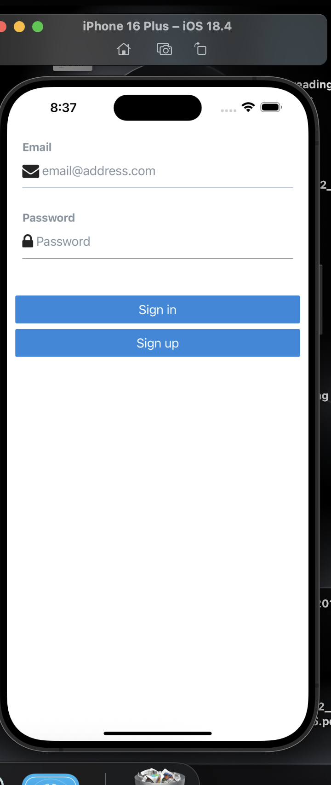
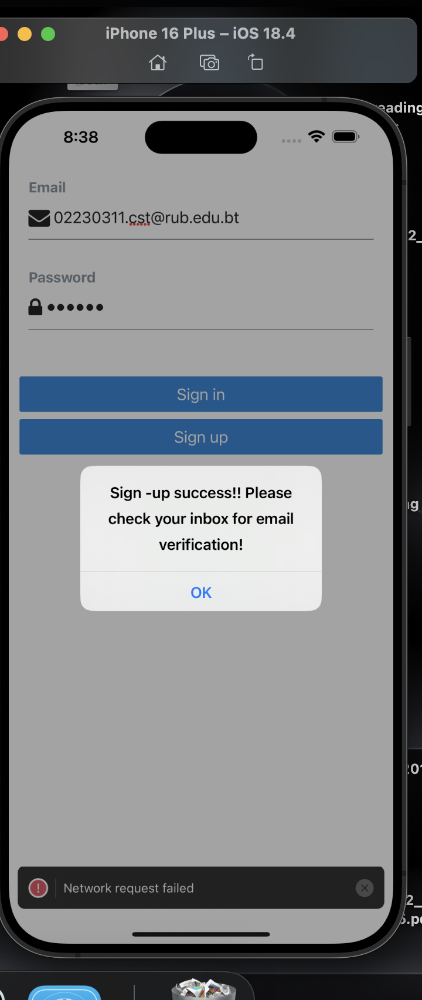

# Magic Link Authentication with Supabase

This project demonstrates the implementation of Magic Link Authentication using Supabase in a React Native application. Magic Link Authentication is a passwordless login method where users receive a link in their email to authenticate themselves, enhancing both security and user experience.

---

## Features

- **Passwordless Authentication**: Users can log in by clicking a magic link sent to their email, eliminating the need for passwords.
- **Environment-Based Redirect URLs**:
  - In **production**, the redirect URL is set to `https://supabase.com/`.
  - In **development**, the redirect URL is set to `http://localhost:3000`.
- **Dynamic Redirect Handling**: The app dynamically sets the redirect URL based on the environment.
- **Supabase Integration**: Utilizes Supabase's `auth.signInWithOtp` method to send magic links for authentication.

---

# Screenshots

## What I Learned

1. **Magic Link Authentication**:
   - A passwordless login method that enhances security and user experience by eliminating the need for remembering passwords.
   
2. **Environment-Based Redirect URLs**:
   - Learned how to dynamically set the redirect URL based on the environment:
     - **Production**: Redirects to the live application.
     - **Development**: Redirects to the local server (`http://localhost:3000`).

3. **Supabase's `signInWithOtp` Method**:
   - Explored how to use Supabase's `auth.signInWithOtp` method to send magic links to users' emails for authentication.

4. **Configuring `emailRedirectTo`**:
   - Learned how to configure the `emailRedirectTo` option to specify where users should be redirected after clicking the magic link.

---

## Challenges Faced

1. Understanding the Supabase authentication API and its implementation requirements.
2. Managing asynchronous operations during the authentication process.
3. Handling and displaying appropriate error messages from the authentication server.
4. Implementing secure password management without exposing sensitive information.
5. Ensuring proper email validation and verification processes.

---

## How I Overcame the Challenges

1. **Studied Supabase Documentation**:
   - Referred to the [Supabase documentation](https://supabase.com/docs) to understand the authentication API thoroughly.

2. **Implemented Async/Await Patterns**:
   - Used `async/await` with proper error handling to manage asynchronous operations effectively.

3. **Error Handling**:
   - Displayed user-friendly error messages to improve the user experience.

4. **Email Validation**:
   - Ensured proper email validation and verification processes to enhance security.

---

